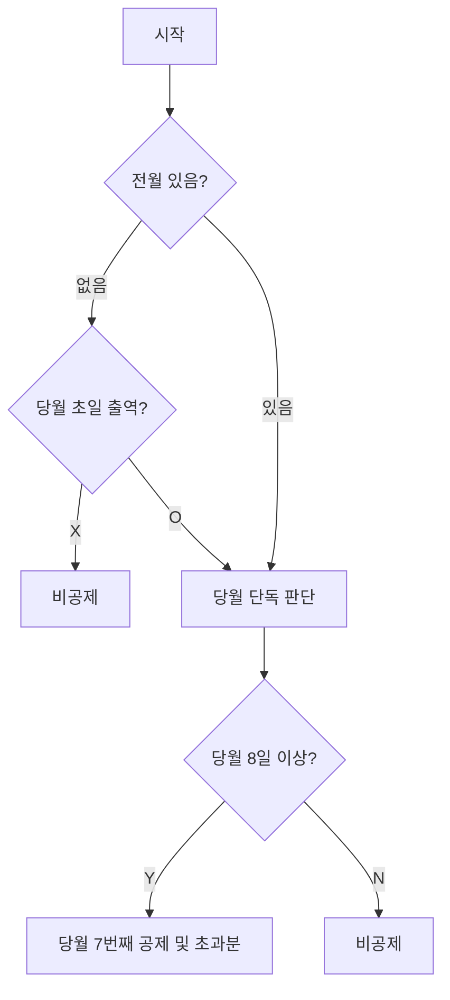
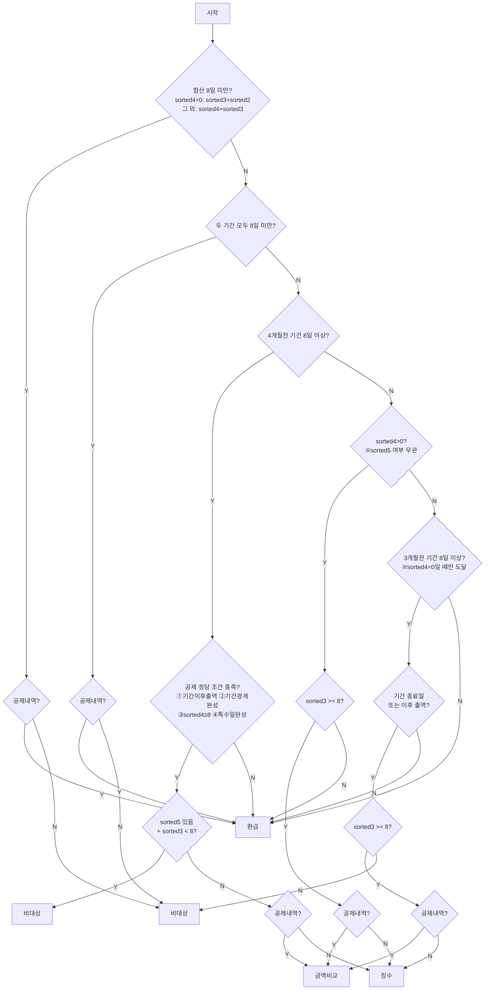
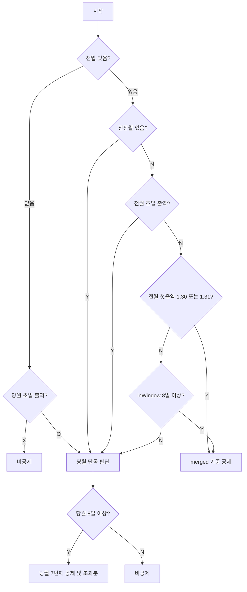
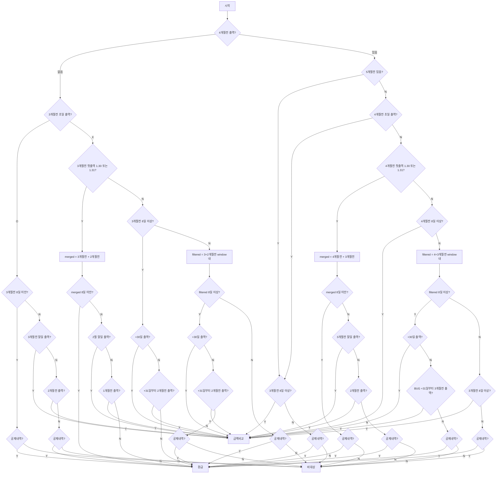

# 건강보험 공제/환급 플로우차트

---

## 공통 개념

### 월 기준 (환급 함수 기준)
환급 함수는 **현재 달 기준 -3개월(대상월)**을 판단합니다.

| 변수명 | 의미 | 예시 (기준월=4월) |
|--------|------|-----------------|
| `sorted5` / `twoMonthsAgo` | 5개월 전 출역 날짜 배열 | 11월 |
| `sorted4` / `oneMonthAgo` | 4개월 전 출역 날짜 배열 | 12월 |
| `sorted3` / `currentMonth` | **3개월 전 (대상월)** 출역 날짜 배열 | **1월** |
| `sorted2` / `oneMonthAfter` | 2개월 전 출역 날짜 배열 | 2월 |
| `twoMonthsAfter` | 1개월 전 출역 날짜 배열 | 3월 |

> 공제 함수는 **당월 기준**이므로 변수 의미가 다름 (`oneMonthAgo` = 전월, `currentMonth` = 당월)

### 결과 용어

| 용어 | 의미 |
|------|------|
| **공제** | 보험료를 급여에서 차감 |
| **환급 (REF)** | 잘못 공제된 보험료를 돌려줌 |
| **비대상 (NORE)** | 공제도 환급도 해당 없음 |
| **금액비교 (AMT)** | 공제된 금액과 실제 납부해야 할 금액을 비교 후 환급 또는 추가 처리 |
| **징수 (DEDUCT)** | 공제가 누락된 경우 보험료를 이제라도 징수 (신규 로직에만 존재) |

### 신규 환급 전용 변수

| 변수 | 의미 |
|------|------|
| `합산` | sorted4>0이면 sorted4+sorted3, sorted4=0이면 sorted3+sorted2 |
| `4개월전 기간` | sorted4 첫출역 ~ 첫출역+(해당월 일수-1)일. 초일 출역이면 말일까지 |
| `3개월전 기간` | sorted3 첫출역 ~ 첫출역+(해당월 일수-1)일. sorted2 날짜 포함 가능 |
| `allDates` | sorted4 + sorted3 + sorted2 날짜 전체 |
| `period4Count` | allDates 중 4개월전 기간 범위 안에 속하는 날짜 수 |
| `period3Count` | allDates 중 3개월전 기간 범위 안에 속하는 날짜 수 |
| `sorted4Enough` | sorted4.length >= 8 (4개월전 단독으로 8일 이상) |
| `공제내역` | 대상월(sorted3)에 실제 공제된 날짜 목록 |

### 기존 공제 전용 변수

| 변수 | 의미 |
|------|------|
| `merged` | 전월 + 당월 날짜를 합쳐서 정렬한 배열 |
| `inWindow` | 전월 첫출역 ~ 전월 첫출역+(해당월 일수-1)일 범위 내 출역 수 |
| `CURR` | 당월 단독 기준으로 공제 (currentMonth[7]이 8번째 날) |
| `MERG` | merged 기준으로 공제 (merged[7]이 8번째 날) |

### 기존 환급 전용 변수

| 변수 | 의미 |
|------|------|
| `merged` | 4개월전 + 3개월전(또는 3개월전 + 2개월전) 합산 배열 |
| `filtered` | 특정 window 범위 내에 속하는 날짜 수 |
| `+30일` | 4개월전(또는 3개월전) 첫출역 기준으로 해당월 일수-1일 후 날짜 |
| `+31일~` | +30일 다음날 이후 출역 여부 |

---

## 신규 공제 (new.js)

---

## 신규 환급 (new.js v2)

> `합산`: sorted4=0이면 sorted3+sorted2, 아니면 sorted4+sorted3  
> `4개월전 기간` = 첫출역 ~ 첫출역+(해당월 일수-1)일 (초일이면 말일까지)  
> `3개월전 기간` = 첫출역 ~ 첫출역+(해당월 일수-1)일 (sorted2 날짜 포함 가능)  
> `allDates` = 4개월전 + 3개월전 + 2개월전

> **Step 5a 공제 정당 조건** (4개 중 하나 충족): ①기간 종료일 이후 출역(`afterPeriod4 > 0`) / ②기간 첫날·마지막날 모두 출역(`firstAndLastWorked`) / ③sorted4 단독 8일 이상(`sorted4Enough`) / ④sorted4가 1/30·31 + sorted3 말일 출역(`sorted3LastDayWorked`)  
> **Step 5a 징수 조건**: `sorted5 없음` + 공제 내역 없음 → 징수. `sorted5 있고 sorted3 < 8`이면 비대상.  
> **Step 5b 공제 정당 조건**: `sorted4 > 0`이면 공제 정당 (sorted5 여부 무관). sorted4=0이면 sorted5 있어도 Step 5c로.  
> **Step 5c 공제 정당 조건**: 기간 종료일 당일(`>=`) 또는 이후 출역. Step 5a(`>` 엄격)와 달리 당일 포함.  
> **Step 5c 징수 조건**: `sorted3 >= 8` + 공제 내역 없음 → 징수 (sorted4=0인 경우라 sorted3 자체가 기준).

---

## 기존 공제 (existing.js — 비교용)

> 신규 공제와의 차이: `전전월 있음`과 `전월 초일`을 별도 분기로 처리

---

## 기존 환급 (existing.js — 비교용)

