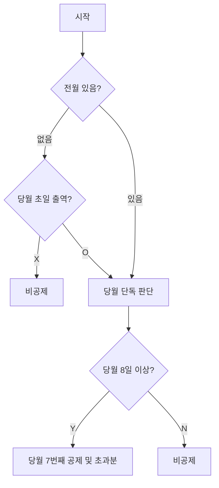
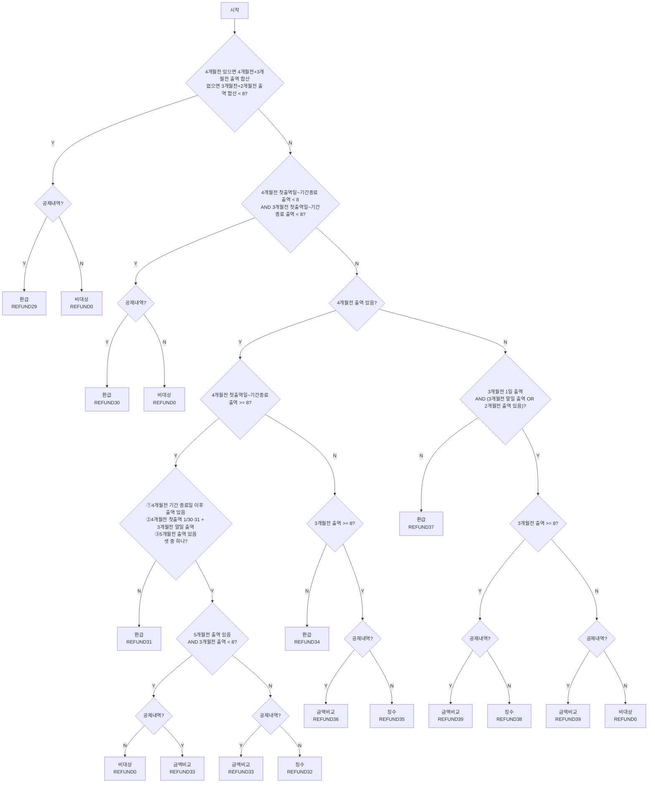
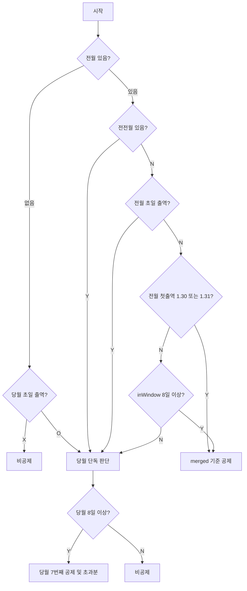
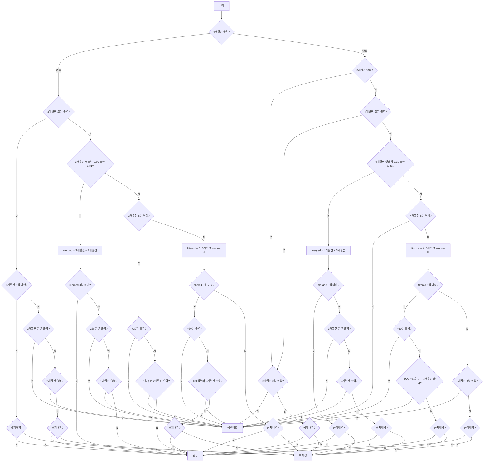

# 건강보험 공제/환급 플로우차트

---

## 공통 개념

### 월 기준 (환급 함수 기준)
환급 함수는 **현재 달 기준 -3개월(대상월)**을 판단합니다.

| 변수명 | 의미 | 예시 (기준월=4월) |
|--------|------|-----------------|
| `sorted5` / `twoMonthsAgo` | 5개월 전 출역 날짜 배열 | 11월 |
| `sorted4` / `oneMonthAgo` | 4개월 전 출역 날짜 배열 | 12월 |
| `sorted3` / `currentMonth` | **3개월 전 (대상월)** 출역 날짜 배열 | **1월** |
| `sorted2` / `oneMonthAfter` | 2개월 전 출역 날짜 배열 | 2월 |
| `twoMonthsAfter` | 1개월 전 출역 날짜 배열 | 3월 |

> 공제 함수는 **당월 기준**이므로 변수 의미가 다름 (`oneMonthAgo` = 전월, `currentMonth` = 당월)

### 결과 용어

| 용어 | 의미 |
|------|------|
| **공제** | 보험료를 급여에서 차감 |
| **환급 (REF)** | 잘못 공제된 보험료를 돌려줌 |
| **비대상 (NORE)** | 공제도 환급도 해당 없음 |
| **금액비교 (AMT)** | 공제된 금액과 실제 납부해야 할 금액을 비교 후 환급 또는 추가 처리 |
| **징수 (DEDUCT)** | 공제가 누락된 경우 보험료를 이제라도 징수 (신규 로직에만 존재) |

### 신규 환급 전용 변수

| 변수 | 의미 |
|------|------|
| `합산` | sorted4>0이면 sorted4+sorted3, sorted4=0이면 sorted3+sorted2 |
| `4개월전 기간` | sorted4 첫출역 ~ 첫출역+(해당월 일수-1)일. 초일 출역이면 말일까지 |
| `3개월전 기간` | sorted3 첫출역 ~ 첫출역+(해당월 일수-1)일. sorted2 날짜 포함 가능 |
| `allDates` | sorted4 + sorted3 + sorted2 날짜 전체 |
| `period4Count` | allDates 중 4개월전 기간 범위 안에 속하는 날짜 수 |
| `period3Count` | allDates 중 3개월전 기간 범위 안에 속하는 날짜 수 |
| `공제내역` | 대상월(sorted3)에 실제 공제된 날짜 목록 |

### 기존 공제 전용 변수

| 변수 | 의미 |
|------|------|
| `merged` | 전월 + 당월 날짜를 합쳐서 정렬한 배열 |
| `inWindow` | 전월 첫출역 ~ 전월 첫출역+(해당월 일수-1)일 범위 내 출역 수 |
| `CURR` | 당월 단독 기준으로 공제 (currentMonth[7]이 8번째 날) |
| `MERG` | merged 기준으로 공제 (merged[7]이 8번째 날) |

### 기존 환급 전용 변수

| 변수 | 의미 |
|------|------|
| `merged` | 4개월전 + 3개월전(또는 3개월전 + 2개월전) 합산 배열 |
| `filtered` | 특정 window 범위 내에 속하는 날짜 수 |
| `+30일` | 4개월전(또는 3개월전) 첫출역 기준으로 해당월 일수-1일 후 날짜 |
| `+31일~` | +30일 다음날 이후 출역 여부 |

---

## 신규 공제 (new.js)

```mermaid
flowchart TD
    S[시작] --> A{"전월 있음?"}
    A -->|없음| B{"당월 초일 출역?"}
    B -->|X| Z1[비공제]
    B -->|O| CURR["당월 단독 판단"]
    A -->|있음| CURR
    CURR --> F{"당월 8일 이상?"}
    F -->|Y| R["당월 7번째 공제 및 초과분"]
    F -->|N| Z2[비공제]
```

---

## 신규 환급 (new.js v2)

> **합산**: 4개월전 출역이 있으면 → 4개월전 + 3개월전 합산 / 없으면 → 3개월전 + 2개월전 합산  
>
> **4개월전 기간 종료일**  
> - 4개월 전 초일(1일) 출역: **4개월 전 말일**  
> - 그 외: **4개월 전 첫 출역일 기준, 해당 달 일수만큼 후** (ex. 4개월 전이 12월이고 12/10 출역 → 12월은 31일이므로 +30일 = 1/9)  
>
> **3개월전 기간 종료일**: 3개월 전 첫 출역일 기준, 해당 달 일수만큼 후 (2개월 전 날짜까지 걸릴 수 있음)  
>
> **전체날짜**: 4개월전 + 3개월전 + 2개월전 출역일 전체

```mermaid
flowchart TD
    S[시작] --> A

    A{"4개월전 있으면 4개월전+3개월전 출역 합산<br/>없으면 3개월전+2개월전 출역 합산 < 8?"}
    A -->|Y| A1{"공제내역?"}
    A1 -->|Y| REF29["환급<br/>REFUND29"]
    A1 -->|N| NORE0a["비대상<br/>REFUND0"]

    A -->|N| B{"4개월전 첫출역일~기간종료 출역 < 8<br/>AND 3개월전 첫출역일~기간종료 출역 < 8?"}
    B -->|Y| B1{"공제내역?"}
    B1 -->|Y| REF30["환급<br/>REFUND30"]
    B1 -->|N| NORE0b["비대상<br/>REFUND0"]

    B -->|N| C{"4개월전 출역 있음?"}

    C -->|Y| D{"4개월전 첫출역일~기간종료<br/>출역 >= 8?"}

    D -->|Y| D1{"①4개월전 기간 종료일 이후 출역 있음<br/>②4개월전 첫출역 1/30·31 + 3개월전 말일 출역<br/>③5개월전 출역 있음<br/>셋 중 하나?"}
    D1 -->|N| REF31["환급<br/>REFUND31"]
    D1 -->|Y| D2{"5개월전 출역 있음<br/>AND 3개월전 출역 < 8?"}
    D2 -->|Y| D2a{"공제내역?"}
    D2a -->|N| NORE0c["비대상<br/>REFUND0"]
    D2a -->|Y| AMT33a["금액비교<br/>REFUND33"]
    D2 -->|N| D3{"공제내역?"}
    D3 -->|Y| AMT33b["금액비교<br/>REFUND33"]
    D3 -->|N| DEDUCT32["징수<br/>REFUND32"]

    D -->|N| E{"3개월전 출역 >= 8?"}
    E -->|N| REF34["환급<br/>REFUND34"]
    E -->|Y| E1{"공제내역?"}
    E1 -->|Y| AMT36["금액비교<br/>REFUND36"]
    E1 -->|N| DEDUCT35["징수<br/>REFUND35"]

    C -->|N| F1{"3개월전 1일 출역<br/>AND (3개월전 말일 출역 OR 2개월전 출역 있음)?"}
    F1 -->|N| REF37["환급<br/>REFUND37"]
    F1 -->|Y| F2{"3개월전 출역 >= 8?"}
    F2 -->|Y| F3{"공제내역?"}
    F3 -->|Y| AMT39a["금액비교<br/>REFUND39"]
    F3 -->|N| DEDUCT38["징수<br/>REFUND38"]
    F2 -->|N| F2a{"공제내역?"}
    F2a -->|Y| AMT39b["금액비교<br/>REFUND39"]
    F2a -->|N| NORE0d["비대상<br/>REFUND0"]
```

### 판단 근거

**4개월전 있으면 4개월전+3개월전, 없으면 3개월전+2개월전 합산 출역 < 8** — 기간 자체가 공제 조건을 못 채움 → 공제내역 있으면 환급, 없으면 비대상

**4개월전 첫출역일~기간종료 출역 < 8 AND 3개월전 첫출역일~기간종료 출역 < 8** — 합산 일수는 8 이상이지만, 어느 한 기간 안에도 연속성 있게 8일을 채우지 못한 경우 → 공제내역 있으면 환급, 없으면 비대상

**4개월전 출역 있음, 4개월전 첫출역일~기간종료 출역 >= 8** — 기간을 채웠어도 공제 정당 여부를 추가 확인  
공제 정당 조건 (3개 중 하나): ①4개월 전 기간 종료일 이후에도 출역이 있음 — "기간이 끊기지 않고 계속 일했음" / ②4개월 전 첫출역이 1/30·31이고 3개월 전 말일에도 출역 — 1월 특수 케이스 연속 완성 / ③5개월 전에도 출역 있음 — 연속근로 인정  
공제 정당 후: 5개월전 출역 있음 + 3개월전 출역 < 8이면 → 공제내역 있으면 금액비교, 없으면 비대상. 그 외 → 공제내역 있으면 금액비교, 없으면 징수

**4개월전 출역 있음, 4개월전 첫출역일~기간종료 출역 < 8** — 4개월 전 출역이 있는 시점에서 공제 정당은 확정  
3개월전 출역 < 8 → 환급 / 3개월전 출역 >= 8 → 공제내역 있으면 금액비교, 없으면 징수

**4개월전 출역 없음** — 3개월 전 기간은 항상 8일 이상임이 보장됨. 연속근로 조건 하나로 공제 정당 여부 판단  
연속근로 조건: 3개월 전 1일 출역 AND (3개월 전 말일 출역 OR 2개월 전 출역 있음) — 이 조건 불충족이면 무조건 환급  
정당 후: 3개월전 출역 < 8 → 공제내역 있으면 금액비교, 없으면 비대상 / 3개월전 출역 >= 8 → 공제내역 있으면 금액비교, 없으면 징수

---

## 기존 공제 (existing.js — 비교용)

```mermaid
flowchart TD
    S[시작] --> A{"전월 있음?"}
    A -->|없음| B{"당월 초일 출역?"}
    B -->|X| Z1[비공제]
    B -->|O| CURR["당월 단독 판단"]
    A -->|있음| C{"전전월 있음?"}
    C -->|Y| CURR
    C -->|N| D{"전월 초일 출역?"}
    D -->|Y| CURR
    D -->|N| E{"전월 첫출역 1.30 또는 1.31?"}
    E -->|Y| MERG["merged 기준 공제"]
    E -->|N| F{"inWindow 8일 이상?"}
    F -->|Y| MERG
    F -->|N| CURR
    CURR --> G{"당월 8일 이상?"}
    G -->|Y| R["당월 7번째 공제 및 초과분"]
    G -->|N| Z2[비공제]
```

> 신규 공제와의 차이: `전전월 있음`과 `전월 초일`을 별도 분기로 처리

---

## 기존 환급 (existing.js — 비교용)

```mermaid
flowchart TD
    S[시작] --> A{"4개월전 출역?"}

    A -->|없음| A1{"3개월전 초일 출역?"}
    A1 -->|O| A1a{"3개월전 8일 미만?"}
    A1a -->|Y| A1a1{"공제내역?"}
    A1a1 -->|Y| REF[환급]
    A1a1 -->|N| NORE[비대상]
    A1a -->|N| A1b{"3개월전 말일 출역?"}
    A1b -->|Y| AMT[금액비교]
    A1b -->|N| A1c{"2개월전 출역?"}
    A1c -->|Y| AMT
    A1c -->|N| A1d{"공제내역?"}
    A1d -->|Y| REF
    A1d -->|N| NORE

    A1 -->|X| A2{"3개월전 첫출역 1.30 또는 1.31?"}
    A2 -->|Y| A2a["merged = 3개월전 + 2개월전"]
    A2a --> A2b{"merged 8일 미만?"}
    A2b -->|Y| REF
    A2b -->|N| A2c{"2월 말일 출역?"}
    A2c -->|Y| AMT
    A2c -->|N| A2d{"1개월전 출역?"}
    A2d -->|Y| AMT
    A2d -->|N| REF

    A2 -->|N| A3{"3개월전 8일 이상?"}
    A3 -->|Y| A3a{"+30일 출역?"}
    A3a -->|Y| AMT
    A3a -->|N| A3b{"+31일부터 2개월전 출역?"}
    A3b -->|Y| AMT
    A3b -->|N| REF
    A3 -->|N| A4["filtered = 3+2개월전 window내"]
    A4 --> A4a{"filtered 8일 이상?"}
    A4a -->|Y| A4b{"+30일 출역?"}
    A4b -->|Y| AMT
    A4b -->|N| A4c{"+31일부터 2개월전 출역?"}
    A4c -->|Y| AMT
    A4c -->|N| A4d{"공제내역?"}
    A4d -->|Y| REF
    A4d -->|N| NORE
    A4a -->|N| A4e{"공제내역?"}
    A4e -->|Y| REF
    A4e -->|N| NORE

    A -->|있음| B{"5개월전 있음?"}
    B -->|Y| BC{"3개월전 8일 이상?"}
    B -->|N| C{"4개월전 초일 출역?"}
    C -->|Y| BC
    BC -->|Y| AMT
    BC -->|N| BC1{"공제내역?"}
    BC1 -->|Y| REF
    BC1 -->|N| NORE

    C -->|N| D{"4개월전 첫출역 1.30 또는 1.31?"}
    D -->|Y| D1["merged = 4개월전 + 3개월전"]
    D1 --> D2{"merged 8일 미만?"}
    D2 -->|Y| D3{"공제내역?"}
    D3 -->|Y| REF
    D3 -->|N| NORE
    D2 -->|N| D4{"3개월전 말일 출역?"}
    D4 -->|Y| AMT
    D4 -->|N| D5{"2개월전 출역?"}
    D5 -->|Y| AMT
    D5 -->|N| D6{"공제내역?"}
    D6 -->|Y| REF
    D6 -->|N| NORE

    D -->|N| E{"4개월전 8일 이상?"}
    E -->|Y| AMT

    E -->|N| F["filtered = 4+3개월전 window내"]
    F --> F1{"filtered 8일 이상?"}
    F1 -->|Y| F2{"+30일 출역?"}
    F2 -->|Y| AMT
    F2 -->|N| F3{"BUG +31일부터 3개월전 출역?"}
    F3 -->|Y| AMT
    F3 -->|N| F4{"공제내역?"}
    F4 -->|Y| REF
    F4 -->|N| NORE
    F1 -->|N| F5{"3개월전 8일 이상?"}
    F5 -->|Y| AMT
    F5 -->|N| F6{"공제내역?"}
    F6 -->|Y| REF
    F6 -->|N| NORE
```
