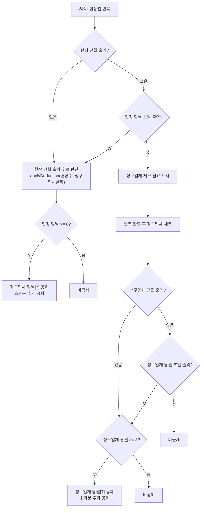
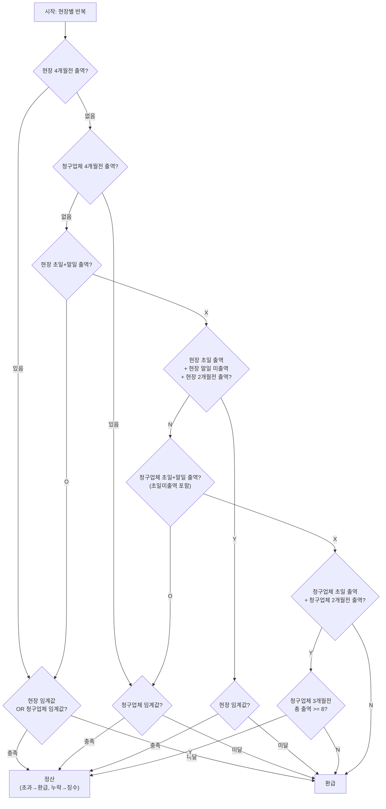
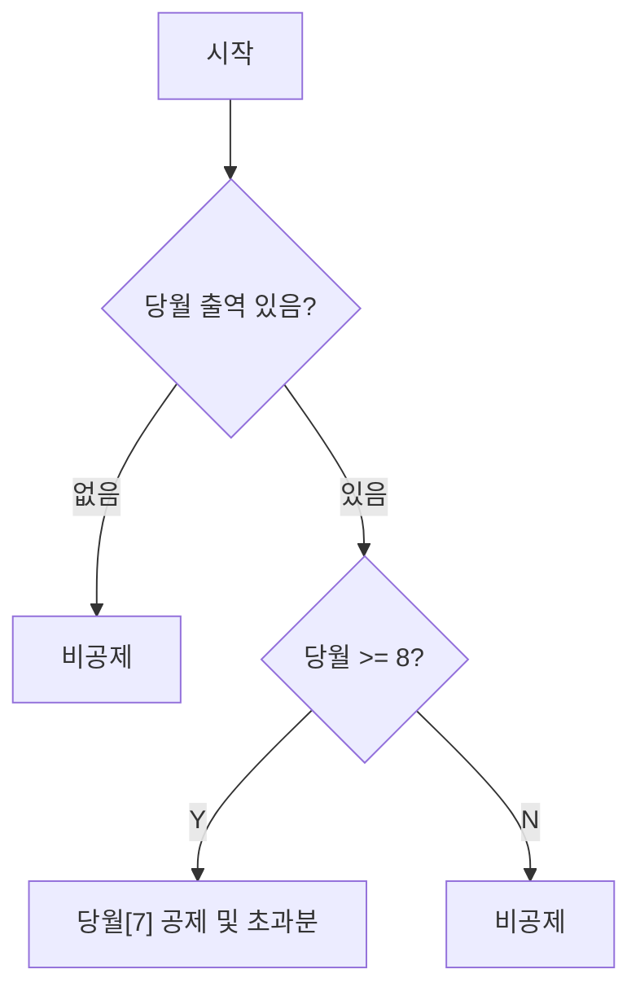
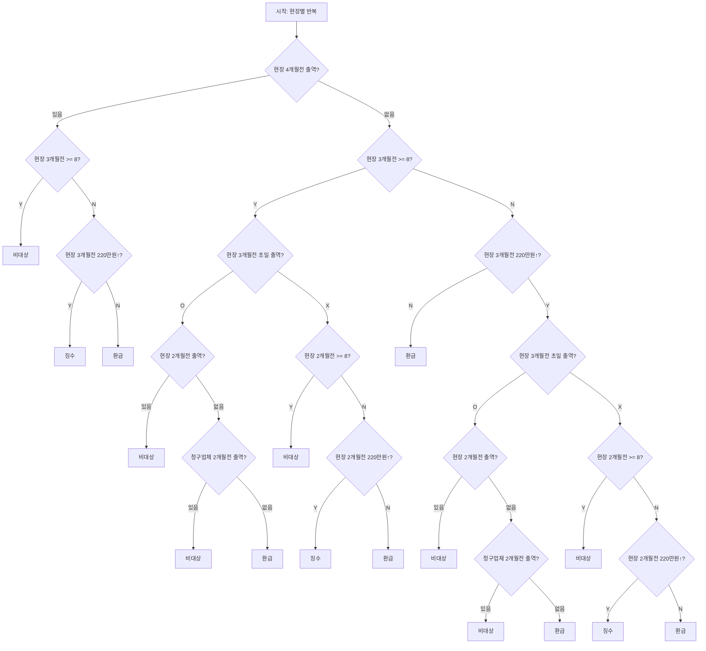

# 국민연금 공제/환급 플로우차트

---

## 공통 개념

### 월 기준

| 코드 변수 | 역할 | 오프셋 | 예시 (기준월 = 4월) |
|---|---|---|---|
| `allPrevMonth` (공제) / `allFourMonthsAgo` (환급) | 4개월 전 (전월) | -1 | 3월 |
| `allCurrentMonth` (공제) / `allThreeMonthsAgo` (환급) | **3개월 전 (대상월)** | 0 | **4월** |
| `allTwoMonthsAfter` (환급 신규) | 2개월 전 | +1 | 5월 |

> 공제·환급 모두 `workMonth`를 기준으로 계산. 대상월 = 기준월 자체.

### 임계값 (threshold)

| 구분 | 조건 |
|---|---|
| **현장 임계값** (`siteMeetsThreshold`) | 현장 3개월전 출역 ≥ 8일 **OR** 현장 3개월전 출역 × 일당 ≥ 2,200,000원 |
| **청구업체 임계값** (`billingMeetsThreshold`) | 청구업체 3개월전 총 출역 ≥ 8일 **OR** 총 출역 × 일당 ≥ 2,200,000원 |

> 청구업체 = 모든 현장 합산

### 결과 용어

| 용어 | 의미 |
|---|---|
| **공제** | 보험료를 급여에서 차감 |
| **정산** | 실제 공제 vs 정당 공제 비교 → 초과분 환급 / 누락분 징수 |
| **환급** | 공제된 금액을 돌려줌 |
| **징수** | 누락된 공제분을 추가 징수 |
| **비대상** | 공제도 환급도 해당 없음 |

### 정산 (reconcileDeduction) 상세

**정당 공제 날짜 계산**:
- 청구업체 3개월전 총 출역 **≥ 8일** → 청구업체 당월 날짜 중 8번째(index 7) 이후 전체
- 청구업체 3개월전 총 출역 **< 8일** → 청구업체 당월 날짜 전체

**비교 결과**:
- 실제 공제 날짜 > 정당 공제 날짜 → 초과분 **환급**
- 정당 공제 날짜 > 실제 공제 날짜 → 누락분 **징수**
- 일치 → **비대상**

---

## 신규 공제 (new.js)

> 현장별(`companyId`) 반복 후 필요 시 청구업체 폴백  
> 공제 날짜는 항상 청구업체 기준(전 현장 합산) 당월 날짜에서 결정됨

> **핵심**: A·B 케이스에서 *현장 당월 출역 수*로 8일 여부를 판단하지만, 공제 마킹 날짜는 청구업체 전체 날짜 기준

---

## 신규 환급 (new.js)

> 현장별(`companyId`) 반복  
> 연속근로 조건 판단 후 정산 / 환급

> **[1]과 [3] 동일 처리**: 현장 4개월전 출역 = 현장 초일+말일 출역 → 동일 연속근로 근거  
> **[2]와 [5] 동일 처리**: 청구업체 4개월전 출역 = 청구업체 초일+말일 출역 → 청구업체 임계값만 체크  
> **[4] 특이점**: 현장 임계값만 적용 (청구업체 임계값 무관), 급여 임계값 포함  
> **[6] 특이점**: 청구업체 3개월전 일수(>= 8)만 체크 (급여 임계값 미적용)

---

## 기존 공제 (existing.js — 비교용)

> 전월 연속성 미고려, 당월 단독 판단  
> 급여 임계값 로직 주석 처리됨 (targetIndex = null 고정)

> 신규 공제와의 차이: 전월 연속성 / 초일 출역 / 청구업체 폴백 없음

---

## 기존 환급 (existing.js — 비교용)

> 현장별 반복 → `handleStatePensionRefundAndDeduct` 위임  
> 현장 4개월전 유무를 최상위 분기로 사용

> **패턴 중복**: `3개월전 >= 8 + 초일 출역` 블록과 `3개월전 < 8 + 220만원↑ + 초일 출역` 블록이 동일한 하위 구조를 반복
